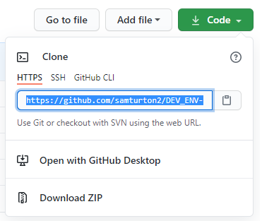

# Setting up a virtual environment
These instructions will take you through how to setup and run this virtual environment to start developing the node app. Please complete the prequisites first and complete the tasks in order.

## Prerequisites
- Click on the below repo, and follow the steps to downloading Ruby, then vagrant, then virtual box. Ignoring step 4 for now.
  -  https://github.com/khanmaster/vb_vagrant_installtion

- Once all 3 programmes are installed clone this repo on your device.
    - copy the link shown below
    
     
    - Open your bash terminal as admin
    - In the directory you want the repo follow these commands
    - `git init`
    - `git clone <pasted link>`


## Main commands
- First check if there is a .vagrant/ file in the repo using
```bash
ls -a
```
- Run command to initiate vagrant in the repo if no .vagrant file is found
```bash
vagrant init
```

- Run this command for a list of your installed plugins
```bash
vagrant plugin list
```

- If it shows `vagrant-hostsupdater` you can move on
- If not: install the plugin using this command
```bash
vagrant plugin install vagrant-hostsupdater
```
- For more information on this plug in view https://github.com/agiledivider/vagrant-hostsupdater or scroll to the extra commands section of this documentation.

- Run this command to start runnning the Virtual Machine
```bash
vagrant up
```

- Run this command to enter the running virtual environment
```bash
 vagrant ssh
```

- If the app is ready to run, you can go to the port 3000 for the home of the app. Type into the url `http://162.170.12.98:3000`

#### Behind the scenes
- Vagrant up should run the the provision.sh file in the environment folder
- In this file we can see all shell commands to install the packages necessary in the Virtual Machine
- If you open the vagrant file in the main directory, you should see the `config.vm.provision` command (line 17)  telling the programme to run the provision installation commands once the virtual environment is up and running.
- The third paragraph in the provision file are the commands to run the app, as you open the VM. Can # it out and enter manually if you dont want the app to run instantly.

## Testing the Virtual Environment
- Open a new terminal whilst the virtual environment is still running.
- Install gems from the gemfile run
```bash
bundle install
```
- Install the gem bundler
```bash
gem install bundler
```
- `cd` into the directory of the `Gemfile` and `Rakefile` which should be in the `spec-tests` folder. e.g  `cd ./environment/spec-tests`

- Run this command to install the tests
```bash
bundler
```

- Run this command to test the environment has all the packages needed
```bash
rake spec
```

- This shoud return at most 4 failures, as long as these failures are the `--version` tests. This is due to the testing programe testing for out of date versions.

### Extra commands
- To exit the running environment
```bash
exit
```

- To destroy the Virtual Machine once exited. (`vagrant up` to start running one again)
```bash
vagrant destroy
```

- To suspend the Virtual Machine
```bash
vagrant suspend
```

- To resume the VM once suspended 
```bash
vagrant resume
```

- To check the status of any `<package>` you should have in your VM. Enter this command in your VM terminal
```bash
sudo systemctl <package> status
```

- If for any reasons the `provision.sh` file commands havent ran and the relevant packages arent installed in the VM, copy the commands from the `provision.sh` file and manually paste them in the VM, and run the testing again.

- Type Error with the `vagrant-hostsupdater`, still finding a fix, but for now can # out the `config.vm.hostname = "www.` line in the Vagrantfile. Can then enter the app by typing the ip address in the url. Once changed make sure you destroy and restart the VM.
